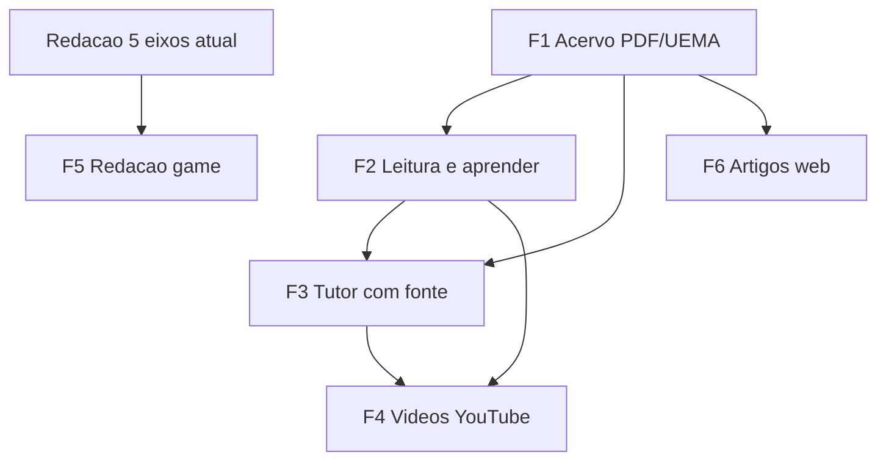

# PAES MED AI — Roadmap futuro (pedido do produto)

Pedidos de produto **agendados** para serem feitos **depois** dos ciclos de fechamento do fio de estudo (sessão / sim / cards / pack canônico).  
Cada item traz a **melhor solução realista** no modelo do app (Flutter Windows + FastAPI local + SQLite), sem inventar incidência UEMA nem % de aprovação.

**Princípios (sempre):**
- Fonte explícita ou “sem base local”.
- Oficial UEMA ≠ treino ≠ web.
- Offline-first: se API/chave faltar, degradação honesta (sem UI que mente).
- Não reabrir floor K–N em massa salvo regressão.

**Ordem global sugerida** (dependências reais):

1. Acervo UEMA + PDF/materiais (fonte)
2. Leitura / busca no app
3. Tutor IA com citação obrigatória
4. Vídeos do tópico do plano
5. Redação gamificada + progresso visual
6. Artigos web (reforço, último)

---

## F1 — Acervo: questões UEMA anteriores + PDFs + matérias

**Pedido:** buscar prova/material PDF/artigos para o aluno **ler e aprender**.

### Melhor solução
| Camada | Solução | Por quê |
|--------|---------|--------|
| Oficial | `data/provas` + `data/gabaritos` + import commit (já existe) + `acervo_fetch` quando houver URL real | Única fonte “oficial” |
| Histórico 2017–23 | Grid honesto: só `committed` com arquivo no disco; senão `empty` / needs_manual | Não inventar prova |
| Matéria (estudo) | PDFs em `data/aulas` ou `data/materiais` com `kind=estudo` | Separar do oficial |
| OCR | Só em fila Avançado, com score/confiança; rascunho professor ≠ banca | Já no espírito do app |
| Web/artigos | Opcional *depois* da base local; CTA “abrir no browser” + rótulo não-oficial | Reforço, não gabarito |

### Entregas
1. Inventário único: oficiais no banco + PDFs no disco + status por ano.  
2. Abrir PDF (viewer simples ou `open` no SO) a partir da Biblioteca / ficha da questão (`sourcePdf` se existir).  
3. Busca unificada no app: subject, topic, year, sourceKind (`oficial` \| `estudo`).  
4. (Opcional) sync portal UEMA só com mapeamento de anos reais + dry-run no smoke.

### Aceite
Aluno encontra e abre material **com fonte**; ano sem PDF continua honesto.

### Fora
Scraper indiscriminado; “IA gerou a prova 2019”.

---

## F2 — Leitura + “aprender” do material importado

**Pedido:** ler e aprender com o acervo (não só gabaritar).

### Melhor solução
- **Reading mode** na Biblioteca / ficha: trecho de teoria (syllabus + edital MD) + link para PDF/ano.  
- Sessão já usa `theorySnippets` — elevar: “Ler 10 min → questões” como checklist visual leve.  
- Aulas: legenda → estrutura → cards (já existe) como caminho de PDF de professor.

### Entregas
1. CTA “Ler teoria deste tópico” na Fila / pós-miss.  
2. Lista “materiais do tema” = edital local + PDFs `estudo` indexados.  
3. Marcar “li” no progresso local (SQLite `settings` ou tabela leve `study_reads`).

### Aceite
Do tópico fraco → teorialocal → treino, sem sair do app em 2 cliques (PDF pode abrir no SO).

---

## F3 — Tutor IA com dúvida + fonte obrigatória

**Pedido:** IA muito boa no assunto, calibrada para **mostrar a fonte**.

### Melhor solução
| Peça | Escolha | Por quê |
|------|---------|--------|
| Base | RAG estrito no SQLite (+ embeddings já existing) | Responde o que o aluno tem |
| Ordem de citação | 1) questão oficial + eixos real → 2) rascunho rotulado → 3) edital/syllabus → 4) “não sei com base local” | Calibração |
| Modelo | OpenAI (ou local se no futuro) via settings; **system prompt de recusa** | Qualidade sem inventar |
| UI | Cada resposta: chip de fontes (`questionId`, year, quality) clicável → ficha | Aceite do pedido |
| Offline | Mensagem clara + snippets só locais sem LLM | Honestidade |

### Entregas
1. Endpoint `POST /api/tutor/ask` com `citations: [{refType, refId, snippet, label}]` obrigatório no schema.  
2. Front `/tutor`: bloquear UI “enviado” se resposta sem `citations` (mesmo lista vazia + motivo).  
3. Preferência `preferOfficial=true` + Natureza se coach do dia for Natureza.  
4. Smoke: mock sem chave + com citação de fixture; nunca inventa `paes-20xx` inexistente.

### Aceite
Pergunta “O que a banca quer em genética?” → texto + link para questões/eixos reais da base ou “sem base”.

### Fora
Chat genérico de Medicina sem retrieval; % de cair o tópico inventada.

---

## F4 — Vídeos sobre o tópico do plano

**Pedido:** IA/API para buscar vídeos do que o aluno está vendo no plano.

### Melhor solução
| Peça | Escolha | Por quê |
|------|---------|--------|
| Query | `subject + topic` (+ “UEMA” \| “ENEM Natureza” só como *search hint*, não rótulo oficial) | Calibrado ao coach/sessão |
| Fonte de resultados | **YouTube Data API** (search.list) + cache SQLite 24–72h | Reproduzível, atualizável |
| Rank (opcional) | LLM reordena com base no syllabus local **só entre resultados da API** | Não inventa URL |
| UI | Card “Reforço em vídeo” na Fila / pós-debrief; abre browser | Performance Windows |
| Sem chave | Lista curada opcional em JSON local por topic key | Degradação |

### Entregas
1. `GET /api/media/videos?subject=&topic=` → `{ items: [{title, channel, url, thumb}], basis: "youtube"|"catalogo_local", disclaimer }`.  
2. Fila + sessão: 1 card se `topic` do dia existir.  
3. Settings: chave YouTube opcional; toggle “sugerir vídeos”.

### Aceite
Meta “Biologia · Genética” → 3–5 vídeos reais + “não é material oficial da banca”.

### Fora
Player pesado embutido no 1º MVP; afirmar que o vídeo “cai na UEMA”.

---

## F5 — Redação gamificada + progresso visual + “várias IAs”

**Pedido:** treinar redação tipo game; IAs se “atualizando”; interface visual de progresso.

### Melhor solução
| Peça | Escolha | Por quê |
|------|---------|--------|
| Score | **5 eixos já existentes** (gramática, coesão, coerência, argumentação, intervenção) como XP por eixo | Reusa backend |
| Game loop | Missões: “Subir coesão”, “Proposta de intervenção”, reescrever trecho → reavaliar | Motivação sem banca falsa |
| Progresso visual | Painel radar/barras + streak de dias + “nível” = média móvel local | UX clara |
| “Várias IAs” | **Personas = prompts** (Revisor de coesão, Crítico de argumento, Leitor de tempo de prova) no mesmo modelo | Atualizam com o histórico do aluno, não multi-agente caro |
| Persistência | Essays + agregado `essay_progress` (max por eixo, last 10) | Dashboard/Fila |

### Entregas
1. UI `/redacao`: hero de progresso (5 eixos) + histórico em timeline.  
2. `GET /api/essays/progress` → eixos, streak, nextMission.  
3. Missões clicáveis → prompt de persona + reavaliar.  
4. Rótulo sempre: “treino local · não nota oficial da prova”.

### Aceite
Após 3 treinos no mesmo eixo, o gráfico sobe de forma coerente com as notas retornadas; sem % de aprovação.

### Fora
Ranking vestibular inventado; multi-modelo autônomo em background no MVP.

---

## F6 — Artigos / leituras web (reforço)

**Pedido:** matérias e artigos para aprender (além do PDF UEMA).

### Melhor solução
- Só **depois** de F1–F3.  
- Provider: Google Custom Search / serper / lista editorial em JSON.  
- UI: “Leitura de reforço” com `title, url, snippet, topic` + disclaimer.  
- Nunca mistura na estatística oficial / frequência da banca.

### Aceite
Lista aberta no browser; zero contagem como “oficiais”.

---

## Mapa de dependências

## Ciclos de implementação (quando for a hora)

| Ciclo (sugerido) | Escopo | Smoke prefix | Estado produto |
|------------------|--------|--------------|----------------|
| FA | F1+F2: PDF open + busca acervo + materials list | (AQ–AW) | **Feito** em ciclos AQ–AW |
| FB | F3: tutor citations schema + UI | (AS) | **Feito** |
| FC | F4: videos API + Fila card | (AY–AZ) | **Feito** |
| FD | F5: essay progress + missions + personas | (AT–BB) | **Feito** (radar em BJ) |
| FE | F6: articles optional | (BC–BF) | **Feito** |
| BG–BJ | Unificar reforço UI · histórico open · catálogo · radar docs | `ciclo_bg_*`…`ciclo_bj_*` | **Feito** |
| BK–BN | Essay timeline · library search · Hoje Z3 · cards/export/sim | `ciclo_bk_*`…`ciclo_bn_*` | **Feito** |
| BO–BR | Plan export · sim checkpoint · ficha/cards · Domínio Z3/Sobre | `ciclo_bo_*`…`ciclo_br_*` | Rodada atual |

## O que **não** entra neste roadmap
- SaaS cobrando aluno  
- Garantia de aprovação / % mágica  
- Inventar edital PDF ou prova ausente  
- Reescrever top-off AE salvo bug  

## Estado (atualizado pós BO–BR)

- Fios AQ…BN fechados; rodada BO–BR: export plano, retomar sim, polish ficha/cards, Domínio Z3 + Sobre.
- Residual próximo TBD.
- Push no GitHub após cada ciclo verde (autor: Yuri Medeiros).
